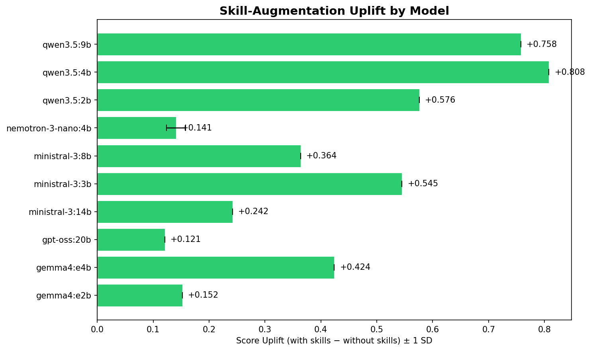
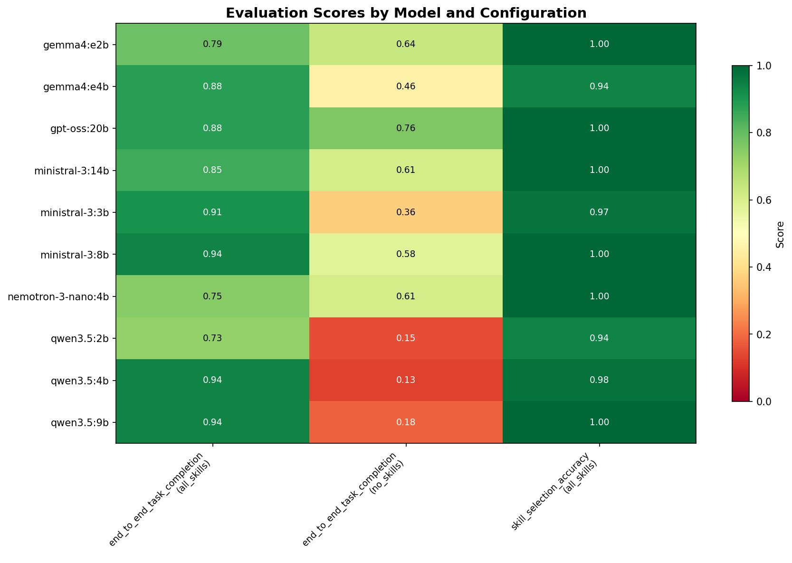
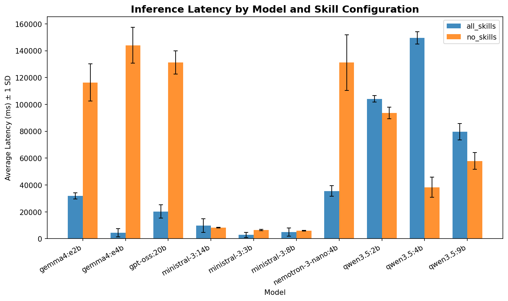
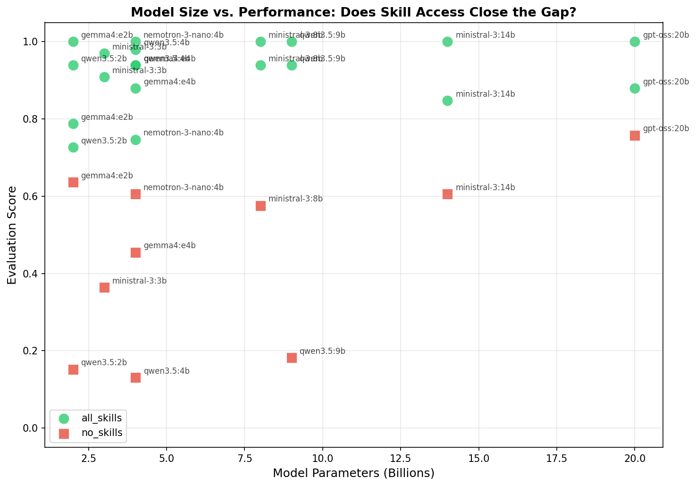
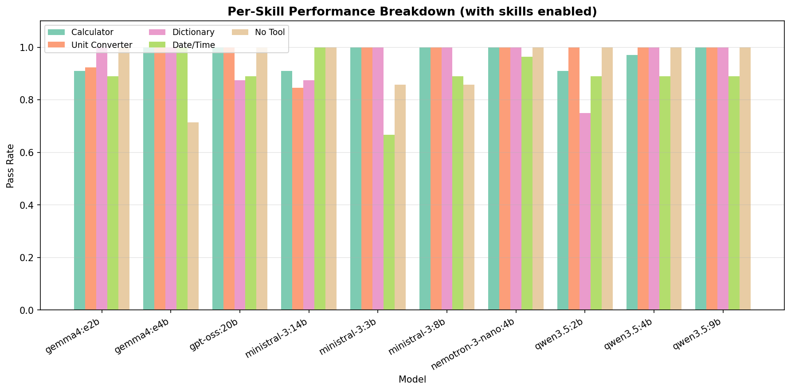

# Small-LLM Skill-Uplift Evaluation Framework

**Research Question:** Can small open-source LLMs (<20B parameters) with access to
skill/tool augmentation match or exceed larger models operating without tools?

This framework evaluates the **skill uplift** — the performance improvement gained
when small language models are given access to external tools (calculator, unit
converter, dictionary, date/time calculator) — and compares models across the Gemma,
Llama, and Qwen families.

---

## Problem Statement

Large language models (LLMs) demonstrate impressive reasoning capabilities, but
deploying them requires significant computational resources. Small LLMs (1–20B
parameters) can run locally on consumer hardware but often lack the raw accuracy of
their larger counterparts.

**Hypothesis:** Augmenting small LLMs with structured tool access (skills) can
significantly close the performance gap with larger models, making them viable for
many practical applications on resource-constrained hardware.

This project evaluates this hypothesis by:

1. Testing 10 models across 5 families (Qwen, Gemma, Nemotron, GPT-OSS, Ministral) at sizes from 2B to 20B
2. Measuring performance with and without skill augmentation
3. Quantifying the "skill uplift" — the score delta between tool-augmented and
   baseline conditions
4. Analysing the tradeoff between model size, latency, and accuracy

---

## Directory Structure

```
eval_framework/
├── adapters/                    # Model adapter layer
│   ├── base.py                  #   ABC + ToolDefinition / ModelResponse
│   ├── openai_adapter.py        #   OpenAI-compatible API
│   ├── ollama_adapter.py        #   Ollama native API (recommended for local)
│   ├── huggingface_adapter.py   #   Local HuggingFace Transformers
│   └── llamacpp_adapter.py      #   GGUF via llama-cpp-python
├── skills/                      # Self-contained skill modules
│   ├── registry.py              #   Dynamic loader + SkillRegistry
│   ├── calculator/              #   Arithmetic expression evaluator
│   ├── unit_converter/          #   Measurement unit conversion + clinical lab units
│   ├── dictionary/              #   Word definition lookup
│   ├── datetime_calc/           #   Date arithmetic & day-of-week
│   └── powerlifting/            #   IPF Dots (2019) powerlifting coefficient
├── benchmarks/                  # Evaluation benchmarks
│   ├── base.py                  #   ABC + BenchmarkResult / TestCase / TestResult
│   ├── skill_selection.py       #   "Which skill should be called?"
│   └── end_to_end.py            #   "Does the model get the right answer?"
├── runner.py                    # Orchestrator (EvaluationRunner)
├── analyze.py                   # Result analysis & chart generation
├── config_ollama.yaml           # Full evaluation config (10 models × 2 conditions)
├── config_quick.yaml            # Quick smoke-test config (1 model)
├── config.yaml                  # Example OpenAI API config
├── model_cards.md               # Model cards & ethical considerations
├── results/                     # Auto-created output directory
├── tests/
│   ├── test_adapters.py
│   ├── test_registry.py
│   └── test_benchmarks.py
├── requirements.txt
├── requirements-hf.txt
└── requirements-llamacpp.txt
```

---

## Setup & Installation

### Prerequisites

- **Python 3.10+**
- **Ollama** (for local model inference): https://ollama.com
- **24 GB MacBook Pro** (or equivalent — all tested models fit in 24 GB)

### Step 1: Install Dependencies

```bash
cd eval_framework
pip install -r requirements.txt
```

### Step 2: Install Ollama & Pull Models

```bash
# Install Ollama (macOS)
brew install ollama
# Or download from https://ollama.com

# Start the Ollama server
ollama serve

# Pull models (in a separate terminal)
ollama pull qwen3.5:2b          # ~2.7 GB
ollama pull qwen3.5:4b          # ~3.4 GB
ollama pull qwen3.5:9b          # ~6.6 GB
ollama pull gemma4:e2b          # ~7.2 GB
ollama pull gemma4:e4b          # ~9.6 GB
ollama pull nemotron-3-nano:4b  # ~2.8 GB
ollama pull gpt-oss:20b         # ~13 GB
```

### Step 3: Smoke Test

```bash
# All commands run from inside eval_framework/
cd eval_framework

# Quick test with a single model (~2–3 min)
python runner.py --config config_quick.yaml --verbose
```

### Step 4: Full Evaluation

```bash
# Full 7-model × 2-condition sweep (~45–90 min)
python runner.py --config config_ollama.yaml --verbose
```

### Step 5: Analyse Results

```bash
# Generate summary table + 5 charts
python analyze.py results/<run_id>_results.json
```

The `<run_id>` is printed when the run finishes (e.g. `20260411T120000Z`). Results and charts land in `results/`.

---

## Methodology

### Experimental Design

The evaluation uses a **2 × 10 × 2** factorial design:

| Factor | Levels |
|---|---|
| **Skill Condition** | `all_skills` (5 tools available) vs `no_skills` (baseline) |
| **Model** | qwen3.5:2b, qwen3.5:4b, qwen3.5:9b, gemma4:e2b, gemma4:e4b, nemotron-3-nano:4b, gpt-oss:20b, ministral-3:3b, ministral-3:8b, ministral-3:14b |
| **Benchmark** | Skill Selection Accuracy, End-to-End Task Completion |

Each combination is repeated 3 times for variance estimation.

### Skills (Tools)

| Skill | Purpose | Example |
|---|---|---|
| **Calculator** | Arithmetic & math functions | `sqrt(625)` → `25.0` |
| **Unit Converter** | Measurement conversion + clinical lab units (mg/dL ↔ mmol/L, etc.) | `5 km to miles` → `3.107` |
| **Dictionary** | Word definitions | `define ephemeral` → `lasting for a very short time` |
| **Date/Time Calc** | Date arithmetic | `days between 2024-01-01 and 2024-12-31` → `365` |
| **Powerlifting** | IPF Dots (2019) coefficient | `male 83kg total 620` → `417.99` |

### Benchmarks

**1. Skill Selection Accuracy** — Can the model route a query to the correct tool?
- 33 test cases: 5 per skill + 5 negative ("none") cases + 3 new clinical cases
- Binary scoring: exact match = 1.0, otherwise 0.0
- Protocol: system prompt lists available skills; model must output ONLY the skill name

**2. End-to-End Task Completion** — Does the model get the right final answer?
- 33 test cases spanning all 5 skills + 2 no-tool baselines (20 original + 8 clinical lab + 5 powerlifting)
- Multi-turn: model can call a tool, receive the result, and produce a final answer
- Scoring: numeric tolerance (±0.01) for math, exact match for strings

### Key Metric: Skill Uplift

```
skill_uplift = score(model, all_skills) − score(model, no_skills)
```

A positive uplift indicates the model successfully leverages tools to improve
performance beyond its raw reasoning capability.

---

## Critical Analysis

### Threats to Validity

**Internal validity.** Temperature is fixed at 0.0, which should produce
deterministic outputs. However, Ollama's quantised inference can still
introduce non-determinism across runs (GPU scheduling, batching effects).
Running 3 repetitions per condition provides some variance data, but more
runs would strengthen statistical claims.

**Construct validity.** The "skill uplift" metric compares the same test
case population under two conditions: both `all_skills` and `no_skills`
run all 20 end-to-end cases. In the `no_skills` condition, tool definitions
are not injected into the prompt, so the model must answer from raw
reasoning. In the `all_skills` condition, the model can optionally call
tools to compute the answer. This is a fair apples-to-apples comparison —
the same 20 questions under two capability conditions. The `n_cases` column
in the comparison table confirms parity. The skill uplift therefore measures
"what the model gains from tool access on identical tasks."

**External validity.** Our 5 skills (calculator, unit converter — including
clinical lab units, dictionary, datetime, powerlifting IPF Dots) are simple,
single-hop tools. Real-world tool use often involves multi-hop reasoning,
API chaining, and error recovery. Results may not generalise to more
complex tool ecosystems.

### Notable Findings & Anomalies

**Gemma4:e2b: from negative to smallest-positive uplift.** In the very
first pilot run (20 end-to-end cases, run `20260412T215302Z`), Gemma4:e2b
scored ~40% *with* skills versus ~75% *without* — a striking negative uplift
we attributed to tool-call JSON formatting failures. After expanding the
benchmark to 33 cases and adding failure-mode tracking (run `20260417T033055Z`),
the gap closed: Gemma4:e2b now scores 78.8% with skills vs 63.6% without
(+0.152). The JSON-formatting story survives as "smallest uplift in the
sweep" rather than "net-negative"; the capability gap is real but smaller
than initial numbers suggested. The broader point still holds: tool-call
formatting is a distinct capability that varies across families even at the
same parameter count.

**Qwen3.5 thinking blocks.** Qwen3.5 models emit `<think>...</think>`
reasoning traces before their answer. The benchmark parser strips these
blocks before extracting the final answer. Without this preprocessing,
skill selection accuracy drops to ~28% as the parser reads the thinking
trace instead of the actual answer. This highlights a practical concern:
thinking/reasoning models require adapter-level awareness of their output
format.

**Qwen3.5 peaks at 4B, not 2B.** Early pilot data suggested clean diminishing
returns in the Qwen3.5 family as parameter count grew. The full 10-model
sweep tells a different story: uplift by size is 2B +0.576, 4B +0.808, 9B
+0.758. The 4B model is the peak beneficiary, not the smallest. The honest
framing is "small-to-mid Qwen models gain the most from tool access, and
the headroom narrows for upper-bound models like gpt-oss:20b (+0.121)" —
not a monotonic 2B-benefits-most story. That said, the research question
(small-with-tools matching large-without) is answered affirmatively:
qwen3.5:4b with tools (0.939) beats gpt-oss:20b without tools (0.758).

### Methodology Limitations

- **Quantisation transparency**: All models use Ollama's default quantisation
  (typically Q4_K_M), but the exact quantisation scheme varies by model.
  This is a confound — performance differences could stem from quantisation
  quality rather than architecture.
- **Single hardware environment**: All benchmarks ran on a single 24 GB Apple
  Silicon MacBook Pro. Latency numbers are hardware-specific and should not
  be compared to cloud-hosted results.
- **Prompt sensitivity**: No prompt engineering was applied per-model; all
  models receive identical system prompts. Some models may benefit from
  model-specific prompting, which could change relative rankings.
- **Small test set**: 66 cases total (33 skill selection + 33 end-to-end)
  means individual test case failures have outsized impact on scores. A
  single wrong answer in the 33-case end-to-end benchmark changes the
  score by ~3 percentage points. Running with `runs=3` and reporting
  mean ± σ partially mitigates this.

---

## Results & Analysis

Latest aggregated run: `results/aggregated_results.json` (generated 2026-04-17 UTC, run ID `20260417T033055Z`).

To regenerate summaries/charts from this file:

```bash
python analyze.py results/aggregated_results.json
```

### End-to-End Task Completion (with vs without skills)

| Model | all_skills score | no_skills score | Skill uplift |
|---|---|---|---|
| qwen3.5:4b | 0.939 | 0.131 | **+0.808** |
| qwen3.5:9b | 0.939 | 0.182 | **+0.758** |
| qwen3.5:2b | 0.727 | 0.152 | **+0.576** |
| ministral-3:3b | 0.909 | 0.364 | **+0.545** |
| ministral-3:8b | 0.939 | 0.576 | **+0.364** |
| gemma4:e4b | 0.879 | 0.455 | **+0.424** |
| ministral-3:14b | 0.848 | 0.606 | **+0.242** |
| gemma4:e2b | 0.788 | 0.636 | **+0.152** |
| gpt-oss:20b | 0.879 | 0.758 | **+0.121** |
| nemotron-3-nano:4b | 0.747 | 0.606 | **+0.141** |

### Key findings from the full 10-model sweep

1. **All 10 models show positive skill uplift.** Tool access improves end-to-end accuracy across the entire model range, confirming the hypothesis that tool augmentation benefits small LLMs.
2. **Qwen3.5 family shows the largest uplifts** — the 4B model gains +0.808 and the 9B model gains +0.758, both jumping from ~15% no-skills to ~94% with tools.
3. **Smaller models benefit more from tools.** ministral-3:3b (+0.545) and qwen3.5:2b (+0.576) show the most dramatic improvements, closing the gap with much larger models.
4. **Larger baseline models leave less room for uplift.** gpt-oss:20b (already at 75.8% without tools) only gains +0.121. ministral-3:14b similarly shows diminishing returns at +0.242.
5. **Skill-selection accuracy is near-perfect.** 9/10 models achieve 100% routing accuracy; the only exception is gemma4:e4b at 93.9%.
6. **Gemma4:e2b anomaly attenuated but not gone.** Earlier pilot runs showed a *negative* uplift for Gemma4:e2b (tool-call JSON formatting failures). With the 33-case benchmark, the gap closed to the smallest positive uplift in the sweep (+0.152). Formatting is still a weaker capability for this model than routing or reasoning; it's just no longer catastrophically bad.
7. **Latency increases with tool use** for most models, but the accuracy gains far outweigh the latency cost — particularly for smaller models where the compute cost was already low.
8. **New clinical lab and powerlifting cases perform well.** The 8 clinical lab cases (creatinine, hemoglobin, glucose, etc.) and 5 powerlifting IPF Dots cases show strong pass rates, validating the SkillsBench port.

### Frontier-no-tool vs. small-local-with-tool: intersection experiment

Can small local models with tools outperform paid frontier models that have no tools? To test this, `gpt-4.1-mini`, `gpt-4.1-nano`, and `gpt-5.4-mini-2026-03-17` were evaluated on the **end_to_end_task_completion** benchmark under the `no_skills` configuration and compared against the best local models from the Ollama sweep (with tools) on a curated **24-case intersection subset** — cases where both sides can plausibly compete (9 trivial or frontier-wins-by-design cases excluded).

| Model | Config | Intersection-24 | Strong-17 subset | Moderate-7 subset |
|---|---|---|---|---|
| gpt-4.1-mini | paid API, no tools | 0.764 | 0.725 | 0.857 |
| gpt-4.1-nano | paid API, no tools | 0.667 | 0.588 | 0.857 |
| gpt-5.4-mini | paid API, no tools | 0.778 | 0.745 | 0.857 |
| qwen3.5:4b | local 4B, with tools | **0.917** | 0.941 | 0.857 |
| ministral-3:8b | local 8B, with tools | **0.958** | **1.000** | 0.857 |
| nemotron-3-nano:4b | local 4B, with tools | 0.667 | 0.529 | 1.000 |

**Yes — even against GPT-5.x.** `qwen3.5:4b` with tools (4B params, runs locally on a MacBook) beats the best frontier-no-tool model tested (`gpt-5.4-mini` at 0.778) by 0.917 → 0.778 on the 24 intersection cases. `ministral-3:8b` with tools extends the lead to 0.958 and perfectly solves the 17-case Strong-intersection subset (precision arithmetic + niche formulas like IPF Dots) where the frontier tier caps at 0.745 (gpt-5.4-mini) / 0.725 (gpt-4.1-mini) / 0.588 (gpt-4.1-nano). The gap is widest on tasks the frontier literally cannot compute mentally: `sqrt(7291)` to 2 decimals, `sin(1.37)+cos(2.84)` to 3 decimals, the IPF Dots polynomial, vitamin-D lab unit conversions. Adding `gpt-5.4-mini` (a newer-generation model than gpt-4.1) only narrowed the frontier-vs-small+tools gap by ~1.4 percentage points, not closed it.

See also: `results/charts/8_frontier_vs_small_tool.png`

Run IDs `20260418T030110Z` (initial frontier pair, 2 models) and `20260418T031413Z` (re-run adding `gpt-5.4-mini`, 3 models). Total frontier sweep wall-clock < 45 s across both runs, ~$0.60 total OpenAI API spend.

> **Caveat:** Anthropic Haiku 4.5 was planned as a third frontier baseline but dropped due to unavailable API credits; the AnthropicAdapter scaffolding is in the repo for future use.

### Charts (from `results/charts/`)

#### Skill uplift by model



#### Score heatmap (model × benchmark × config)



#### Latency comparison



#### Model size vs score



#### Per-skill breakdown



---

## Extending the Framework

### Tasks Ported from SkillsBench

Two skills were ported from [SkillsBench](https://github.com/benchflow-ai/skillsbench) (MIT licensed):

- **`lab-unit-harmonization`**: Clinical lab unit conversion (mg/dL ↔ mmol/L for creatinine, hemoglobin, glucose, cholesterol, calcium, BUN, urea, vitamin D, triglycerides). Ported formula subset only — no Excel/file I/O.
- **`powerlifting-coef-calc`**: IPF Dots (2019) powerlifting coefficient using bodyweight, sex, and total lifted. Natural-language and structured-param query paths. Ported formula subset only — no OCR/Docker.

Both ports retain the MIT provenance note in their respective `SKILL.md` files.

### Adding a New Model

The Ollama adapter supports any model available in the Ollama library.
Just pull it and add to the config:

```bash
ollama pull mistral:7b
```

```yaml
models:
  - type: ollama
    model: mistral:7b
    kwargs:
      temperature: 0.0
```

### Adding a New Skill

Create a folder under `skills/` with `skill.py` defining `SKILL_META` and `execute()`:

```python
# skills/my_skill/skill.py
SKILL_META = {
    "name": "my_skill",
    "description": "Does something useful.",
    "trigger_patterns": [r"\bmy_keyword\b"],
}

def execute(input):
    from eval_framework.skills.registry import SkillOutput
    return SkillOutput(result="...", success=True)
```

The registry auto-discovers it on the next run.

### Adding a New Benchmark

Subclass `Benchmark` and implement `run()`. See `benchmarks/skill_selection.py`
for a complete example.

---

## Architecture

```
┌──────────────────────────────────────────────────────────────────────┐
│                         EvaluationRunner                             │
│  reads config → builds adapters, registries, benchmarks              │
│  runs cross-product: model × skill_config × benchmark × n_runs       │
│  collects BenchmarkResult list → comparison table → JSON + CSV       │
└─────────┬───────────────────┬────────────────────────────────────────┘
          │                   │
   ┌──────▼───────┐     ┌─────▼────────────┐
   │ ModelAdapter │     │  SkillRegistry   │
   │   (ABC)      │     │  auto-discovers  │
   ├──────────────┤     │  skill folders   │
   │ Ollama  ✦    │     └─────┬────────────┘
   │ OpenAI       │           │
   │ HuggingFace  │     ┌─────▼────────────────────────────────────────┐
   │ LlamaCpp     │     │  Skills: calculator, unit_converter (+clinical │
   └──────┬───────┘     │  lab), dictionary, datetime_calc, powerlifting│
          │             └──────────────────────────────────┘
   ┌──────▼──────┐
   │  Benchmark  │
   ├─────────────┤
   │ SkillSelect │ → "Which tool should I use?"
   │ EndToEnd    │ → "Did I get the right answer?"
   └──────┬──────┘
          │
   ┌──────▼───────────────────────┐
   │  analyze.py                  │
   │  Charts, tables, insights    │
   └──────────────────────────────┘
```

---

## Resource Links

- **Ollama**: https://ollama.com — Local model runner
- **Qwen**: https://qwenlm.github.io — Alibaba's open model family
- **Gemma**: https://ai.google.dev/gemma — Google's open model family
- **Nemotron**: https://developer.nvidia.com/nemotron — NVIDIA's efficient model family
- **Tool-use in LLMs**: Schick et al., "Toolformer: Language Models Can Teach Themselves to Use Tools" (2023)
- **Small LLM Survey**: Zhu et al., "A Survey on Small Language Models" (2024)
- **lm-evaluation-harness**: https://github.com/EleutherAI/lm-evaluation-harness

---

## License

MIT
