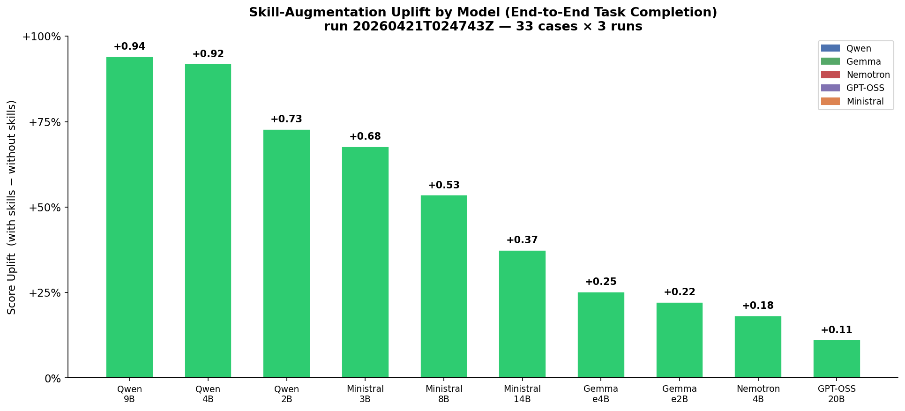
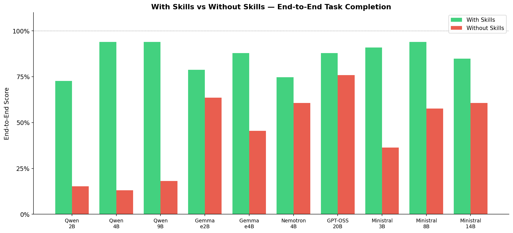
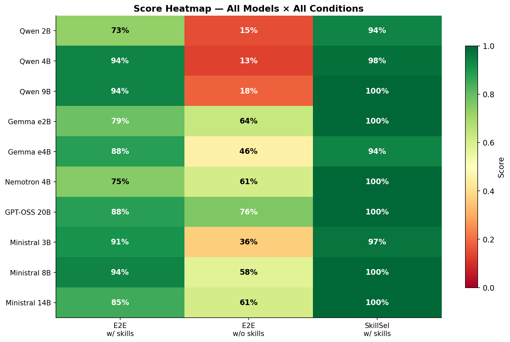
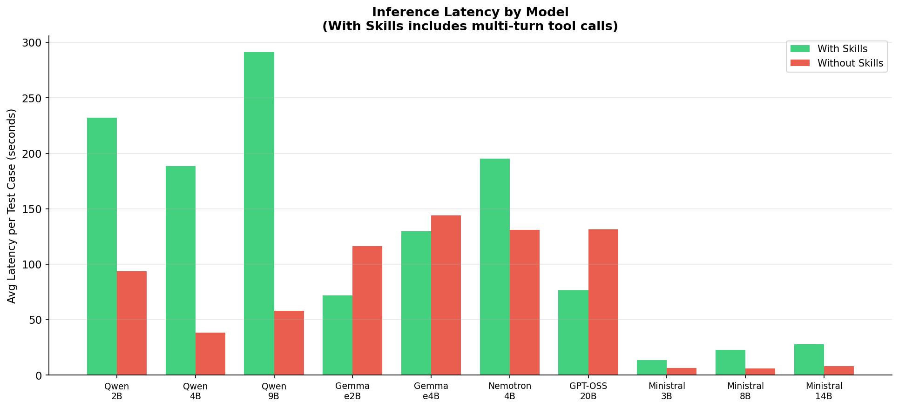
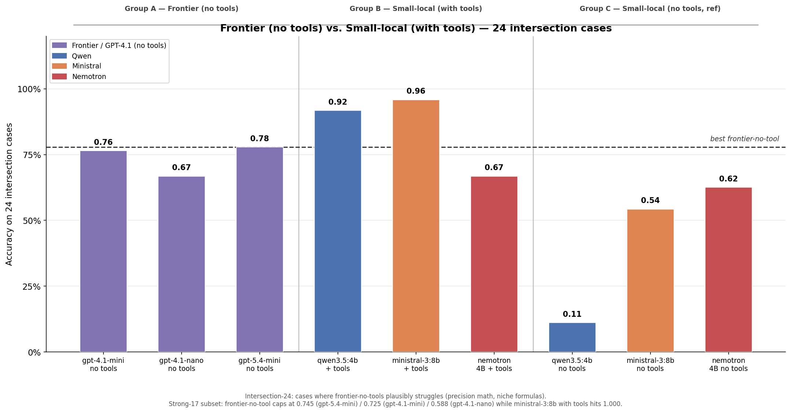
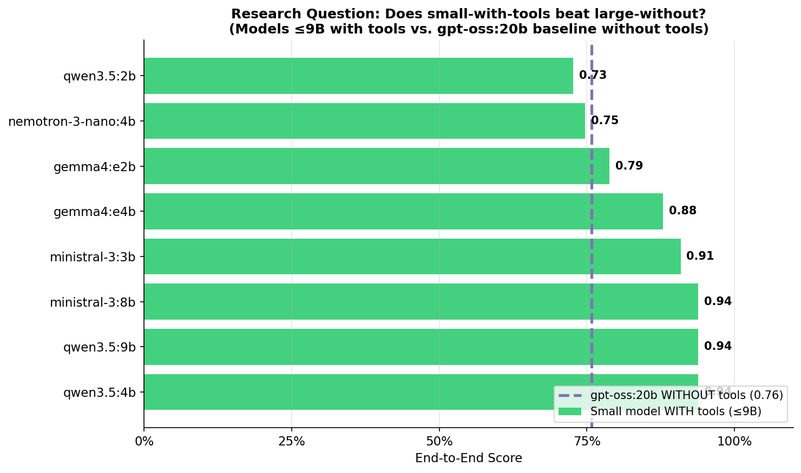
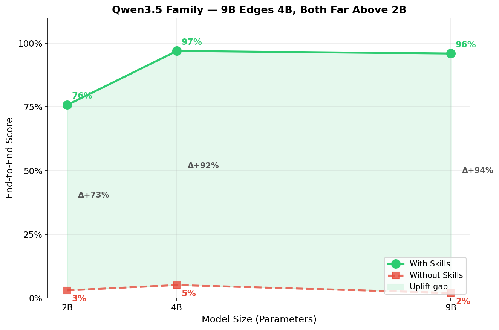

# Small‑LLM Skill‑Uplift Evaluation Framework

> **Research question:** *Can small open‑source LLMs (<20 B parameters) with
> access to skill / tool augmentation match or exceed larger models operating
> without tools?*

This README is a walkthrough. It tells the story of the project in the order I
actually built and ran it: the question, the design, the implementation, how to
reproduce it, what I found, the anomalies I hit along the way, and my honest
assessment of what the results do and don't prove.

---

## 1. The Problem

Large LLMs are impressive but expensive to serve. Small LLMs (1–20 B) run on a
laptop, yet their raw reasoning is weaker. A natural question for anyone
shipping local AI products is whether giving a small model a handful of
reliable tools — a calculator, a unit converter, a dictionary — can bridge the
gap. If it can, "small + tools" is a viable product strategy; if it can't, we
really do need the 70 B model.

**Hypothesis.** Structured tool access narrows the gap between small local
LLMs and larger models enough that a 4–8 B model with tools is competitive
with a 20 B model (or a frontier API) without tools, for the class of tasks
where the tool is actually useful.

---

## 2. My Approach

The evaluation has **two arms** that together answer the research question:

| Arm | Config file | Models | Conditions | Purpose |
|---|---|---|---|---|
| **A. Local sweep** | `config_ollama.yaml` | 10 Ollama models (2 B – 20 B) | `all_skills` vs `no_skills` | Measures *skill uplift* per model |
| **B. Frontier baseline** | `config_frontier.yaml` | 3 OpenAI API models | `no_skills` only | "Larger LLM without tools" benchmark |

Two benchmarks are run on each configuration:

- **Skill‑selection accuracy** — "Given a query, which tool should you call?"
- **End‑to‑end task completion** — "Did you produce the right final answer?"

The headline metric is **skill uplift**, the per‑model delta between
`all_skills` and `no_skills` on the end‑to‑end benchmark:

```
skill_uplift(m) = score(m, all_skills) − score(m, no_skills)
```

A large positive uplift means the model effectively leverages tools; a small
or zero uplift means either the model is already good enough to solve tasks
without tools, or it's *bad* at using tools and they don't help.

> **Scope caveat (stated upfront).** I planned a third arm using Anthropic
> Haiku 4.5 as a second frontier baseline but dropped it when I couldn't get
> an Anthropic API credit allocation in time. The `AnthropicAdapter` is in
> the repo and the adapter layer is tested; only the sweep is missing. The OpenAI arm
> (three models, three runs each) is what ships.

---

## 3. What I Built

A small, plug‑in‑oriented evaluation harness. Three abstract base classes hold
the design together and everything else is swappable:

```
EvaluationRunner (runner.py)
 ├── ModelAdapter   ← Ollama (primary), OpenAI, Anthropic, HF, llama.cpp
 ├── SkillRegistry  ← auto-discovers skills/<name>/skill.py
 └── Benchmark      ← skill_selection, end_to_end
```

### 3.1 The five skills

| Skill | What it does | Example input → output |
|---|---|---|
| **calculator** | Arithmetic + `sqrt`, `sin`, `log`, etc. | `sqrt(625)` → `25.0` |
| **unit_converter** | Measurement + clinical lab units (mg/dL ↔ mmol/L) | `5 km to miles` → `3.107` |
| **dictionary** | Word definitions | `define ephemeral` → `lasting for a very short time` |
| **datetime_calc** | Date arithmetic / day‑of‑week | `days between 2024‑01‑01 and 2024‑12‑31` → `365` |
| **powerlifting** | IPF Dots (2019) coefficient | `male 83 kg total 620` → `417.99` |

`unit_converter` (clinical lab subset) and `powerlifting` are ports of
SkillsBench tasks (`lab-unit-harmonization` and `powerlifting-coef-calc`,
MIT‑licensed). I ported the formula subsets only — no Excel I/O, no OCR, no
Docker.

Each skill is a self‑contained folder with a `SKILL.md` description and a
`skill.py` that defines `SKILL_META` and `execute()`. The registry
auto‑discovers them on startup, so adding a new skill is a no‑wiring change.

### 3.2 The two benchmarks

**Skill‑selection accuracy (33 cases).** 5 positive cases per skill + 5
negative ("none") cases + 3 new clinical cases. The prompt lists the skills
and the model must output *only* the skill name. Binary exact‑match scoring.

**End‑to‑end task completion (33 cases).** Multi‑turn: the model can call a
tool, receive the result, and produce a final answer. 20 original cases + 8
clinical lab + 5 powerlifting. Numeric answers are scored with ±0.01
tolerance; dictionary answers are scored by 60 % keyword overlap on words of
length ≥ 3 (exact‑match is impossible for definitions).

> **What "tool use" means here.** In `skill_selection_accuracy`, no tool is
> executed; the model only names the skill it would choose. In
> `end_to_end_task_completion`, enabled skills are exposed as structured tool
> definitions; if the model emits a valid tool call, the harness runs the
> corresponding local Python `execute()` function and feeds the result back for
> the final answer. These are narrow benchmark skills, not arbitrary shell or
> OS commands.

> **Apples‑to‑apples check.** Both `all_skills` and `no_skills` run the full
> 33 cases. In `no_skills`, tool definitions simply aren't injected into the
> prompt — the model must answer from raw reasoning. The `n_cases` column in
> the comparison CSV confirms parity. This is important: an earlier version
> of the filter accidentally ran `no_skills` on only 2 trivial cases, which
> made uplift meaningless. That bug is documented in `CLAUDE.md` so it
> doesn't come back.

### 3.3 Adapters

| Adapter | Used for |
|---|---|
| `OllamaAdapter` | All 10 local models (native `/api/chat`, 300 s timeout) |
| `OpenAIAdapter` | The 3 frontier models (reads `OPENAI_API_KEY`) |
| `AnthropicAdapter` | Scaffolding only — Haiku dropped from this run |
| `HuggingFaceAdapter`, `LlamaCppAdapter` | Alternate local runners |

---

## 4. The Models I Tested

### Arm A — Local (Ollama, 24 GB MacBook Pro, Q4_K_M quantisation)

| Model | Params | Family | Notes |
|---|---|---|---|
| qwen3.5:2b | 2 B | Qwen | Thinking model — emits `<think>` blocks |
| qwen3.5:4b | 4 B | Qwen | Thinking model |
| qwen3.5:9b | 9 B | Qwen | Thinking model |
| gemma4:e2b | 2 B | Gemma | Historical JSON‑formatting struggle |
| gemma4:e4b | 4 B | Gemma | |
| nemotron‑3‑nano:4b | 4 B | Nemotron | NVIDIA edge‑optimised |
| ministral‑3:3b | 3 B | Ministral | |
| ministral‑3:8b | 8 B | Ministral | |
| ministral‑3:14b | 14 B | Ministral | |
| gpt‑oss:20b | 20 B | GPT‑OSS | Largest local model; "upper bound" baseline |

### Arm B — Frontier (OpenAI API, `no_skills` only)

| Model | Notes |
|---|---|
| gpt‑4.1‑mini | Predictable pricing tier |
| gpt‑4.1‑nano | Cheapest contrast point |
| gpt‑5.4‑mini (2026‑03‑17 snapshot) | Newer‑generation frontier‑mini tier |

Full ethical / bias / data‑card details for all models live in
[`model_cards.md`](./model_cards.md).

---

## 5. How to Reproduce

All commands run from the `sLLM_eval_framework/` project root.

### 5.1 Prerequisites

- Python 3.10+
- [Ollama](https://ollama.com) for the local arm
- An `OPENAI_API_KEY` for the frontier arm (budgeted under a ~$5 cap)
- A machine with ≥ 24 GB unified memory for the local 20 B model

### 5.2 Install

```bash
pip install -r requirements.txt
```

### 5.3 Pull the local models

```bash
ollama serve  # in a separate terminal

ollama pull qwen3.5:2b
ollama pull qwen3.5:4b
ollama pull qwen3.5:9b
ollama pull gemma4:e2b
ollama pull gemma4:e4b
ollama pull nemotron-3-nano:4b
ollama pull ministral-3:3b
ollama pull ministral-3:8b
ollama pull ministral-3:14b
ollama pull gpt-oss:20b
```

### 5.4 Smoke test (~10–20 min)

```bash
python runner.py --config config_quick.yaml --verbose
```

### 5.5 Full local sweep (~3 h with `runs=3` on a 24 GB M‑series)

```bash
python runner.py --config config_ollama.yaml --verbose
```

### 5.6 Frontier baseline (~45 s, ~$0.60 OpenAI spend)

```bash
OPENAI_API_KEY=sk-... python runner.py --config config_frontier.yaml --verbose
```

### 5.7 Analyse (generates tables + the 8 slide‑ready charts)

```bash
# Merges any new runs into results/aggregated_results.json
python merge_results.py results/

# Tables + the 5 analytical charts
python analyze.py results/aggregated_results.json

# The 8 slide-ready charts (latest full local sweep + frontier slice)
python charts_gen.py
```

Run IDs are printed at the end of each sweep (e.g. `20260421T024743Z`). Raw
results land in `results/<run_id>_results.json`, summaries in
`results/<run_id>_summary.csv`, and charts in `results/charts/`.

---

## 6. Results — Act I: Does tool access help small local models?

Run `20260421T024743Z` · 10 models · 33 end‑to‑end cases · `runs=3` ·
`temperature=0.5` · `num_predict=5096`.

### 6.1 End‑to‑end scores, sorted by uplift

| Model | `all_skills` | `no_skills` | Skill uplift |
|---|---|---|---|
| qwen3.5:9b | 0.960 | 0.020 | **+0.939** |
| qwen3.5:4b | 0.970 | 0.051 | **+0.919** |
| qwen3.5:2b | 0.758 | 0.030 | **+0.727** |
| ministral‑3:3b | 0.980 | 0.303 | **+0.677** |
| ministral‑3:8b | 0.990 | 0.455 | **+0.535** |
| ministral‑3:14b | 0.980 | 0.606 | **+0.374** |
| gemma4:e4b | 0.929 | 0.677 | **+0.253** |
| gemma4:e2b | 0.838 | 0.616 | **+0.222** |
| nemotron‑3‑nano:4b | 0.798 | 0.616 | **+0.182** |
| gpt‑oss:20b | 0.889 | 0.778 | **+0.111** |



### 6.2 What this tells us

1. **All 10 models show positive uplift.** Tools help every model, even the
   20 B one — just by different amounts.
2. **Qwen3.5 9 B and 4 B are the biggest winners** (+0.939 and +0.919). Their
   no‑tools baselines collapse to ~2–5 %, then jump to ~96–97 % once tools are
   available.
3. **Most small models now beat the 20 B no‑tools baseline.** Seven of the
   eight local models at ≤ 9 B score above `gpt‑oss:20b` without tools
   (0.778); only `qwen3.5:2b` falls just short at 0.758.
4. **Larger baselines still leave less headroom.** `gpt‑oss:20b` starts the
   highest unaided at 0.778, so it posts the smallest uplift at +0.111 even
   after rising to 0.889 with tools.
5. **Skill routing is strong for most models, but not uniformly perfect.**
   Seven models hit 1.000 on skill selection, `gemma4:e4b` lands at 0.970,
   `ministral‑3:3b` at 0.939, and `qwen3.5:2b` is the clear laggard at 0.848.




Latency, of course, goes up when tools are in play (multi‑turn inference):



---

## 7. Results — Act II: How do frontier models do *without* tools?

Runs `20260418T030110Z` + `20260418T031413Z` · 3 OpenAI models · 33 end‑to‑end
cases · `runs=3` · `no_skills` only. Combined wall‑clock < 45 s, ~$0.60 total
spend. The table below reports the latest rerun values from `20260418T031413Z`.

| Model | Config | End‑to‑end score (33 cases) | σ |
|---|---|---|---|
| gpt‑4.1‑mini | paid API, no tools | **0.828** | 0.017 |
| gpt‑4.1‑nano | paid API, no tools | **0.727** | 0.000 |
| gpt‑5.4‑mini | paid API, no tools | **0.758** | 0.030 |

Two things are worth noting before we compare against the locals:

- **Even the frontier nano tier beats every local model's no‑tools score
  except gpt‑oss:20b.** gpt‑4.1‑nano (0.727) out‑reasons every ≤ 14 B local
  model in the no‑skills column.
- **gpt‑4.1‑mini slightly edges out gpt‑5.4‑mini** (0.828 vs 0.758) on this
  specific suite. That's not a statement about general capability — the
  benchmark skews toward precise arithmetic and niche formulas where
  gpt‑4.1‑mini happens to be tuned well.

---

## 8. Results — Act III: Head‑to‑head on the intersection

Comparing frontier‑no‑tools against small‑local‑with‑tools across all 33
cases would be unfair in both directions: some cases are trivial reading
comprehension (frontier wins by default), and some are pure tool calls like
"evaluate `sqrt(7291)` to 2 decimals" (the frontier literally can't compute
that mentally to spec). I manually curated a **24‑case intersection subset**
where both sides can plausibly compete, plus a **Strong‑17** precision
subset and a **Moderate‑7** everyday subset.

- **Intersection‑24** = the full comparison slice used in this section:
  **Strong‑17 + Moderate‑7**.
- **Strong‑17** = the hardest precision-heavy tasks: 4 advanced calculator
  cases (`sin`/`cos`, `sqrt`, mixed `log2`/`sqrt`, decimal arithmetic), all 8
  clinical lab conversions, and all 5 powerlifting Dots calculations.
- **Moderate‑7** = more ordinary structured tasks: 2 simpler calculator cases,
  2 standard unit conversions (`km → miles`, `grams → ounces`), and 3 date
  questions (days-between / day-of-week).

In other words, **Strong‑17** asks "who wins when exact computation really
matters?", while **Moderate‑7** asks "who wins on everyday structured
problems?" Dictionary-definition items and the trivial no-tool baseline prompts
are not part of this head-to-head slice.

| Model | Config | Intersection‑24 | Strong‑17 | Moderate‑7 |
|---|---|---|---|---|
| gpt‑4.1‑mini | frontier, no tools | 0.764 | 0.725 | 0.857 |
| gpt‑4.1‑nano | frontier, no tools | 0.667 | 0.588 | 0.857 |
| gpt‑5.4‑mini | frontier, no tools | 0.778 | 0.745 | 0.857 |
| qwen3.5:4b | local 4 B, **with tools** | **0.958** | 0.941 | **1.000** |
| ministral‑3:8b | local 8 B, **with tools** | **1.000** | **1.000** | **1.000** |
| nemotron‑3‑nano:4b | local 4 B, with tools | 0.722 | 0.608 | **1.000** |



### 8.1 The answer, plainly

**Yes — a 4 B or 8 B local model with tools still beats the best
frontier‑no‑tools model tested, and the gap is wider in the latest local
rerun.** `qwen3.5:4b` with tools now scores **0.958** on the intersection
subset versus **0.778** for `gpt‑5.4‑mini`, and `ministral‑3:8b` reaches
**1.000** on all 24 cases. The newest local sweep therefore puts the gap at
roughly **18–22 percentage points**, not a near tie.

The gap is widest exactly where you'd expect: `sqrt(7291)` to 2 decimals,
`sin(1.37) + cos(2.84)` to 3 decimals, the IPF Dots polynomial, vitamin‑D
lab unit conversions. Tasks a language model literally cannot do mentally to
the required precision.

And the research‑question chart, plainly stated:



---

## 9. Anomalies I encountered

### 9.1 Gemma4:e2b went from "negative uplift" to a stable positive uplift

In the very first pilot (`20260412T215302Z`, 20 cases), gemma4:e2b scored
~40 % *with* skills versus ~75 % *without* — a striking negative uplift
attributed to tool‑call JSON formatting failures. After expanding to 33
cases and adding failure‑mode tracking, the gap closed and stayed closed:
gemma4:e2b is now **+0.222** with skills (**83.8 % vs 61.6 %**). It is no
longer the smallest positive uplift in the sweep; that now belongs to
`gpt‑oss:20b` at +0.111. The honest story is that the early negative result
was unstable and disappeared once the benchmark matured.

### 9.2 Qwen3.5 no longer peaks cleanly at 4 B

Early data suggested clean diminishing returns: "the smaller the model, the
more tools help." The later full sweeps told a more nuanced story.



In the latest rerun, Qwen3.5 uplift by size is **2 B +0.727, 4 B +0.919,
9 B +0.939**. So the earlier "4 B is the clear peak" claim no longer holds:
9 B edges 4 B, and both are far above 2 B. The truthful framing now is
"tool access transforms the whole Qwen ladder, with 4 B and 9 B both near
ceiling once tools are available."

### 9.3 Qwen3.5 thinking blocks

Qwen3.5 models emit `<think>...</think>` reasoning traces before their
answer. The benchmark parser strips these blocks before extracting the final
answer — with two regex passes, because the model sometimes *doesn't close*
the `<think>` tag. Without this preprocessing, skill‑selection accuracy
collapses to ~28 %. Reasoning‑model output format is an adapter‑level concern
that every tool‑use benchmark needs to handle.

### 9.4 `no_skills` case filtering bug

An early version of the filter used `skills is None` to skip cases, which
meant `no_skills` ran only 2 trivial baseline cases instead of the full
suite — making skill uplift meaningless. The correct filter is
`if c.get("skill") and skills is not None and c["skill"] not in skills`.
Documented in `CLAUDE.md` so it doesn't regress.

---

## 10. Threats to validity

- **Quantisation confound.** All local models use Ollama's default
  quantisation (typically Q4_K_M), but the exact scheme varies by model. A
  capability difference *could* be a quantisation‑quality difference, not
  architecture. A clean re‑run at matched quantisation is future work.
- **Single hardware environment.** All latencies are a 24 GB Apple Silicon
  MacBook Pro. Don't compare to cloud‑hosted deployments.
- **Prompt sensitivity.** No per‑model prompt engineering was applied;
  everyone gets the same system prompt. Some models probably benefit from
  model‑specific prompting.
- **Small test set.** 66 cases total (33 + 33). A single wrong answer in
  end‑to‑end changes a score by ~3 percentage points. `runs=3` mitigates
  but doesn't eliminate this.
- **Frontier arm scope.** Only OpenAI; Anthropic Haiku was planned but not
  run. Gemini isn't in scope. Claims are "vs OpenAI frontier‑mini tier,"
  not "vs all frontier models."
- **Construct validity is fine.** Both conditions run the same 33 cases;
  only the tool definitions differ. The uplift metric is an apples‑to‑apples
  comparison of identical tasks under two capability conditions.

---

## 11. Answer to the research question

> *Can small open‑source LLMs (<20 B) with tools match or exceed larger
> models without tools?*

**Yes, with qualifications:**

1. Against the 20 B local upper bound (`gpt‑oss:20b` at 0.778 without tools),
   `qwen3.5:4b` with tools (0.970) wins outright.
2. Against the frontier‑mini tier without tools (`gpt‑5.4‑mini` at 0.778 on
   the full suite / 0.778 on the intersection), `qwen3.5:4b` with tools
   (0.958 intersection) and `ministral‑3:8b` with tools (1.000 intersection,
   1.000 Strong‑17) both win clearly.
3. The gap is biggest on precision‑math and niche‑formula tasks. On everyday
   reading or trivial arithmetic, frontier‑no‑tools ties or wins.
4. "Small + tools" is the better product strategy *for the class of tasks
   where a tool exists*. That's the qualification — none of this generalises
   to open‑ended reasoning or tool ecosystems the model hasn't been
   rehearsed on.

---

## Appendix A — Extending the framework

### Add a new model

```bash
ollama pull mistral:7b
```

```yaml
# config_ollama.yaml
models:
  - type: ollama
    model: mistral:7b
    kwargs:
      temperature: 0.0
```

For an API model use `type: openai` or `type: anthropic` and an
`api_key`‑bearing env var.

### Add a new skill

```python
# skills/my_skill/skill.py
SKILL_META = {
    "name": "my_skill",
    "description": "Does something useful.",
    "trigger_patterns": [r"\bmy_keyword\b"],
}

def execute(input):
    from sLLM_eval_framework.skills.registry import SkillOutput
    return SkillOutput(result="...", success=True)
```

Add a `SKILL.md` alongside it. The registry auto‑discovers on the next run.

### Add a new benchmark

Subclass `Benchmark` and implement `run()`. `benchmarks/skill_selection.py`
is a complete reference.

---

## Appendix B — Directory layout

```
sLLM_eval_framework/
├── adapters/                 # ModelAdapter implementations
│   ├── base.py               #   ABC + ToolDefinition / ModelResponse
│   ├── ollama_adapter.py     #   Primary (native /api/chat)
│   ├── openai_adapter.py     #   Frontier arm
│   ├── anthropic_adapter.py  #   Scaffolding (Haiku dropped from this run)
│   ├── huggingface_adapter.py
│   └── llamacpp_adapter.py
├── skills/                   # Auto-discovered by skills/registry.py
│   ├── calculator/
│   ├── unit_converter/       #   Includes clinical lab units
│   ├── dictionary/
│   ├── datetime_calc/
│   └── powerlifting/         #   IPF Dots 2019 (SkillsBench port, MIT)
├── benchmarks/
│   ├── base.py
│   ├── skill_selection.py
│   ├── end_to_end.py
│   └── utils.py              #   Centralised <think>-tag stripping
├── runner.py                 # EvaluationRunner, CLI entry point
├── analyze.py                # Tables + 5 analytical charts
├── charts_gen.py             # 8 slide-ready charts (snapshot)
├── merge_results.py          # Merges run JSONs → aggregated_results.json
├── config_ollama.yaml        # Arm A (10 local models × 2 conditions)
├── config_frontier.yaml      # Arm B (3 OpenAI models, no-tools only)
├── config_quick.yaml         # Smoke test
├── config.yaml               # Example OpenAI config
├── model_cards.md            # Model cards + data card + ethics
├── results/
│   ├── aggregated_results.json
│   ├── <run_id>_results.json
│   ├── <run_id>_summary.csv
│   └── charts/
└── tests/                    # pytest; uses mock adapters (no Ollama needed)
```

---

## Appendix C — Architecture

```
┌────────────────────────────────────────────────────────────────────┐
│                      EvaluationRunner                              │
│  config → build adapters, registry, benchmarks                     │
│  cross-product: model × skill_config × benchmark × n_runs          │
│  collect BenchmarkResults → comparison table → JSON + CSV          │
└─────────┬───────────────────┬──────────────────────────────────────┘
          │                   │
   ┌──────▼───────┐     ┌─────▼──────────┐
   │ ModelAdapter │     │  SkillRegistry │
   │ Ollama  ✦    │     │  auto-discover │
   │ OpenAI  ✦    │     └─────┬──────────┘
   │ Anthropic    │           │
   │ HuggingFace  │           │
   │ LlamaCpp     │           ▼
   └──────┬───────┘     Skills: calculator, unit_converter (+clinical
          │             lab), dictionary, datetime_calc, powerlifting
          ▼
   ┌─────────────┐
   │  Benchmark  │
   │ SkillSelect │ → "Which tool should I use?"
   │ EndToEnd    │ → "Did I get the right answer?"
   └──────┬──────┘
          ▼
   ┌──────────────────────┐
   │ analyze / charts_gen │
   └──────────────────────┘
```

Key design decisions:

- Concurrency = 1 for Ollama (sequential model load/unload); concurrency = 4
  for the frontier arm (APIs handle parallel fine).
- Temperature = 0.0 everywhere for reproducibility. Quantised inference
  still has some non‑determinism, which is why `runs=3`.
- `enabled: null` = no registry loaded (true baseline); `enabled: []` = all
  skills loaded; `enabled: [...]` = a specific subset.

---

## Resources

- **Ollama** — https://ollama.com
- **Qwen** — https://qwenlm.github.io
- **Gemma** — https://ai.google.dev/gemma
- **Nemotron** — https://developer.nvidia.com/nemotron
- **SkillsBench** (ports: lab‑unit‑harmonisation, powerlifting‑coef‑calc) —
  https://github.com/benchflow-ai/skillsbench (MIT)
- Schick et al., *Toolformer: Language Models Can Teach Themselves to Use
  Tools* (2023)
- Zhu et al., *A Survey on Small Language Models* (2024)
- **lm‑evaluation‑harness** — https://github.com/EleutherAI/lm-evaluation-harness

---

## License

MIT
